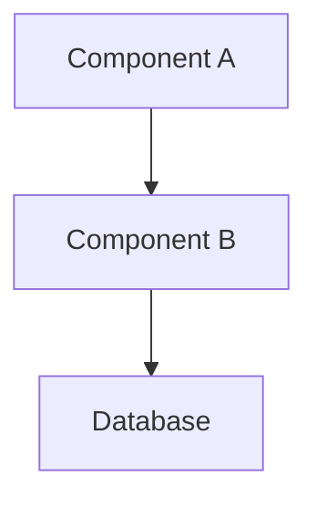

# Documentation Skill

## When to Use
- Writing function/class docstrings
- Updating README files
- Creating architecture documentation
- API documentation
- Inline code comments

## Documentation Types

### 1. Code Docstrings (Python)

```python
def calculate_order_total(
    items: List[OrderItem],
    discount_code: Optional[str] = None
) -> Decimal:
    """Calculate the total price for an order.
    
    Applies item prices, quantities, and any valid discount code.
    
    Args:
        items: List of order items with price and quantity.
        discount_code: Optional promotional code for discount.
        
    Returns:
        Total order amount as Decimal.
        
    Raises:
        ValueError: If items list is empty.
        InvalidDiscountError: If discount code is invalid or expired.
        
    Example:
        >>> items = [OrderItem(price=10.00, qty=2)]
        >>> calculate_order_total(items, "SAVE10")
        Decimal('18.00')
    """
```

### 2. README Structure

```markdown
# Project Name

Brief description of what this project does.

## Quick Start

```bash
# Installation
uv venv && uv sync

# Run tests
uv run pytest tests/ -v

# Start development
uv run python main.py
```

## Architecture

[Brief overview or link to docs/design/]

## Development

### Prerequisites
- Python 3.10+
- uv package manager

### Setup
```bash
./scripts/init-project.sh
```

### Testing
```bash
uv run pytest tests/ -v
```

## Contributing

[Guidelines or link to CONTRIBUTING.md]

## License

[License type]
```

### 3. Architecture Docs

Location: `docs/design/{feature}-architecture.md`

```markdown
# [Feature] Architecture

## Overview
[What this feature does and why]

## Components



## Data Flow
[How data moves through the system]

## API Contracts
[Key endpoints and their contracts]

## Key Decisions
| Decision | Rationale |
|----------|-----------|
| [Choice] | [Why] |

## Security Considerations
[Security-relevant aspects]
```

### 4. Inline Comments

**DO comment:**
- Why (not what) for non-obvious code
- Business logic reasoning
- Workarounds with references (issues, tickets)
- Complex algorithms

**DON'T comment:**
- What the code obviously does
- Obvious variable names
- Every line

```python
# ✅ Good: Explains WHY
# Retry with exponential backoff to handle transient API failures
# See: https://github.com/company/project/issues/123
for attempt in range(3):
    ...

# ❌ Bad: Explains WHAT (obvious from code)
# Loop 3 times
for attempt in range(3):
    ...
```

## Documentation Checklist

### For New Features
- [ ] Architecture doc in `docs/design/`
- [ ] Function docstrings
- [ ] README updated if needed
- [ ] API docs if endpoints added

### For Bug Fixes
- [ ] Document root cause in commit
- [ ] Update docs if behavior changed

### For Refactoring
- [ ] Update affected docstrings
- [ ] Update architecture docs if structure changed

## Sync with Traceability

When creating docs, update `traceability_matrix.json`:

```json
{
  "id": "REQ-001",
  "arch_artifacts": ["docs/design/auth-architecture.md"],
  "ux_artifacts": [".design/REQ-001-ux.json"]
}
```

## Output Format

```markdown
## Documentation Update: [scope]

### Files Updated
- `docs/design/feature.md` - Created architecture doc
- `src/auth/login.py` - Added docstrings

### Traceability
Updated REQ-001 arch_artifacts

### Preview
[Show key sections of new/updated docs]
```

